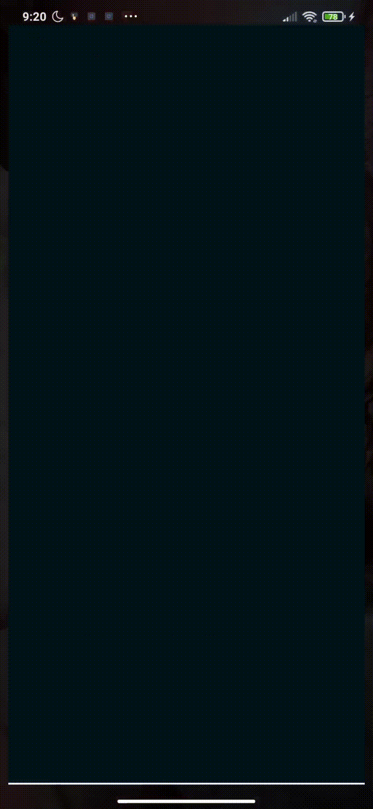
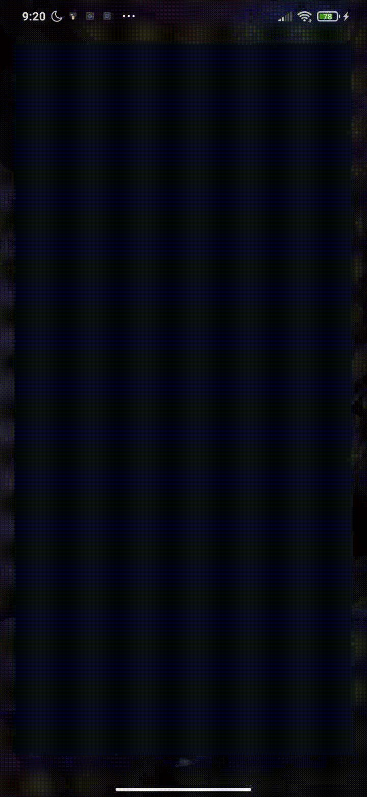

# GNBTrades

## About the app
This application gets transactions from a API and identifies unique product ids showing a list of products.
If one item is selected, a detail from the product with a list of it transactions will be displayed.
All transactions amounts are converted to euros and a total amount will be displayed as well.

API Server gives random results, so displayed products can be different each time.

Also, I’ve decided to set API 30 as targetsdkversion and follow google recommendations choosing API 23 as minsdkversion.
see full official documentation

## Development
This app is developed in Kotlin using clean architecture with repository pattern, mvvm for presentation layer.

List of used libraries:

 * retrofit
 * Okhttp
 * Hilt
 * Android architecture components: LiveData, Viewmodel
 * Coroutines
 * Room
 * Navigation Component

## Requeriments
  - [X] Download information when app starts
  - [X] Show list of products
  - [X] Show a detail view with product transactions with amount transformed into EURO and the total amount of all transactions
  - [X] Don't block the UI

## Extra Points
  - [ ] Try not to use floating point numbers (I had issues with Moshi adapter and BigDecimal)
  - [X] Use Banker's rounding in amounts
  - [X] Use headers instead of file extensions in API Request
